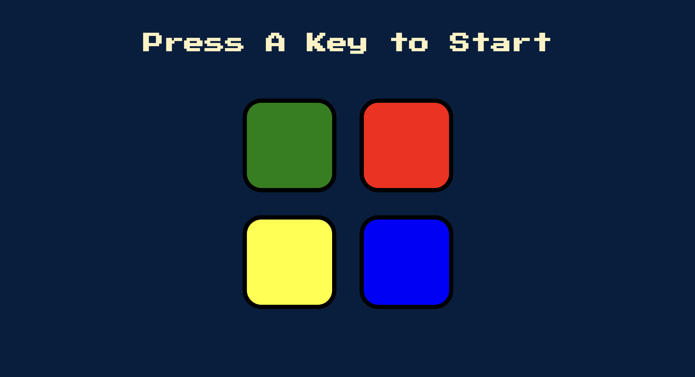

# Simon Game

A recreation of the famous Simon Game. 

From Wikipedia: "Simon is an electronic game of short-term memory skill invented by Ralph H. Baer and Howard J. Morrison, working for toy design firm Marvin Glass and Associates, with software programming by Lenny Cope. The device creates a series of tones and lights and requires a user to repeat the sequence."